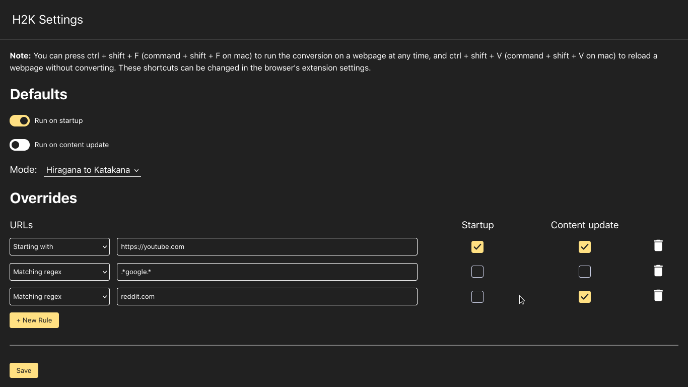
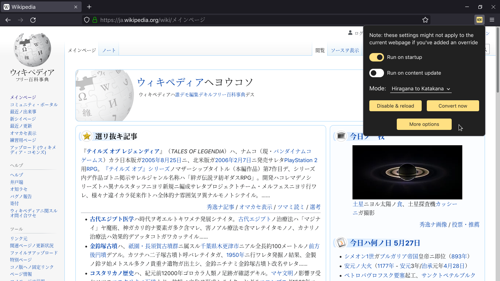

# H2K
If you're learning Japanese, you'll probably notice that your katakana reading speed is slower than your hiragana reading speed, due to a lack of practice. This extension fixes that by letting you convert hiragana on a webpage to katakana. It also lets you do the reverse, which can be helpful if you don't know katakana yet.

H2K's functionality is customizable - you can make it run by default on all webpages on both the initial load and whenever the content updates, or you can disable them selectively. You can also add overrides for specific websites - for example, you can disable H2K entirely on one website, and enable conversion on the initial load alone on another.

## Installation

For firefox, you can install it from the firefox [add-ons site](1).

For Chrome, Brave, Edge, Vivaldi, and other Chromium-based browsers, you can install from source using the instructions below.

### Installing from source

**Chromium-based browsers**
+ Download the source code of this repo
+ Enter `chrome://extensions` in the URL bar
+ Enable the switch for developer mode
+ Click on the 'Load unpacked' button
+ Select the folder with the source code

**Firefox**
+ Download the source code of this repo
+ For the storage functions to work, you need to specify an add-on ID, so open the `manifest.json` file and add something this with any ID you want:
```json
"browser_specific_settings": {
    "gecko": {
        "id": "hiragana@katakana"
    }
},
```
+ Enter `about:debugging` in the URL bar
+ Click on 'This Firefox' in the left sidebar
+ Click on the 'Load Temporary Add-on...' button
+ Select any file inside the source code folder

[1]: https://addons.mozilla.org/en-US/firefox/addon/h2k/

## Screenshots




